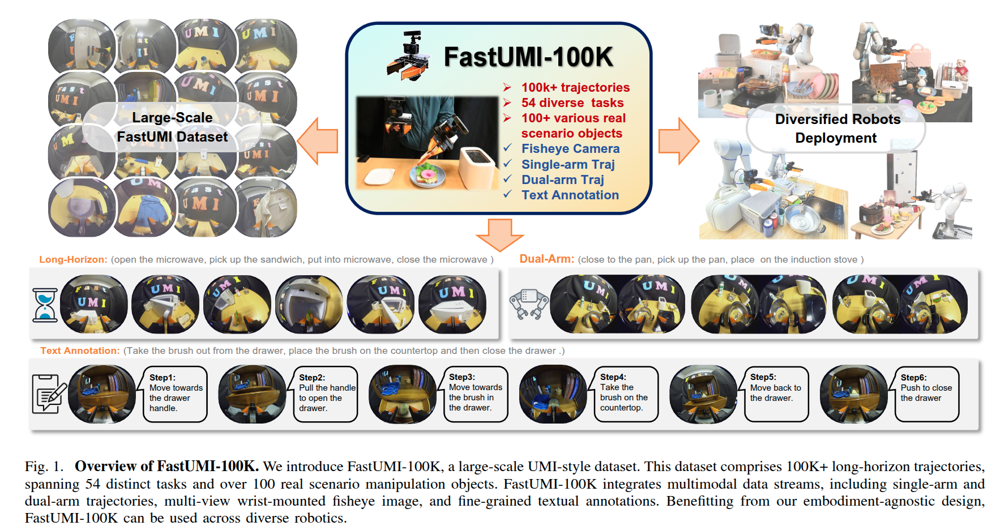

# FastUMI-100K
## Advancing Data-driven Robotic Manipulation with a Large-scale UMI-style Dataset

*Large-scale, high-quality robotic manipulation demonstration dataset*

---

## 📖 Introduction

Data-driven robotic manipulation learning depends on large-scale, high-quality expert demonstration datasets. However, existing datasets, which primarily rely on human teleoperated robot collection, are limited in terms of scalability, trajectory smoothness, and applicability across different robotic embodiments in real-world environments.

We present **FastUMI-100K**, a large-scale UMI-style multimodal demonstration dataset, designed to overcome these limitations and meet the growing complexity of real-world manipulation tasks. Collected by FastUMI, a novel robotic system featuring a modular, hardware-decoupled mechanical design and an integrated lightweight tracking system, FastUMI-100K offers a more scalable, flexible, and adaptable solution to fulfill the diverse requirements of real-world robot demonstration data.

---

## ✨ Dataset Features

| Feature | Description |
|---------|-------------|
| **📊 Scale** | Over 100,000+ demonstration trajectories |
| **🎯 Tasks** | Covers 54 tasks and hundreds of object types |
| **🏠 Environment** | Representative household environments |
| **📸 Multimodal** | End-effector states, multi-view wrist-mounted fisheye images and textual annotations |
| **⏱️ Length** | Each trajectory ranges from 120 to 500 frames |

---

## 🚀 Coming Soon

| 🎯 **What's Next** | 📝 **Description** |
|-------------------|-------------------|
| 📄 **Paper** | Detailed technical paper and experimental results |
| 💾 **Dataset** | Complete dataset download links |
| 🔧 **Code** | Source code and toolkits |
| 📚 **Documentation** | Comprehensive usage documentation and tutorials |

---

*More detailed information will be released soon, stay tuned!*

**⭐ If this project helps you, please give us a star!**

